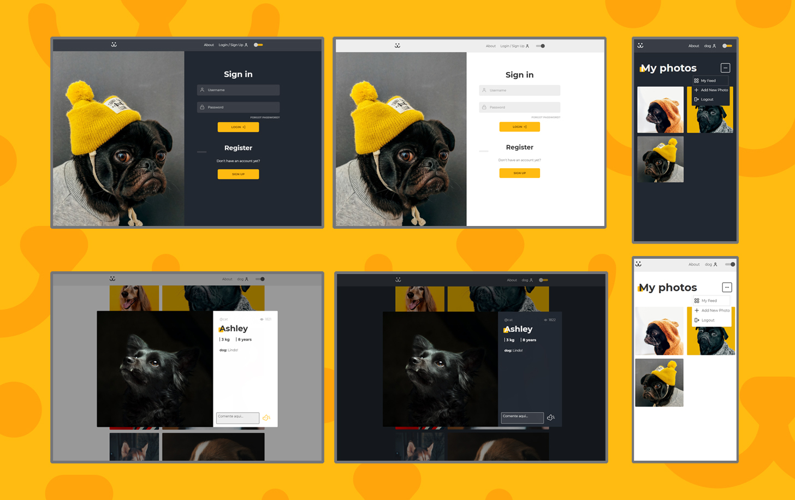

<h1 align="center">
<br>
  

<br>

<a href="https://reactjs.org/">
  
</a>

</h1>

<h1 align="Center">
💻 Project
</h1>

#### Dogs is a social network for dogs, similar to Instagram. You can register, comment on photos, delete photos, view user profiles and many other things.

<h3 align="center">
  
<h3>

<h1 align="Center">
🎨 Screens
</h1>
<h3 align="center">
  
<h3>

> Responsive for multiple screens

<h1 align="Center">
 🚀 Technologies
</h1>

The project was developed with these technologies:

- ✔️ ReactJS

- ✔️ React Router DOM

- ✔️ Styled Components

- ✔️ React Hooks

- ✔️ Theme Switcher

- ✔️ Context API

<h1 align="Center">
⚙ Run Dogs
</h1>

Follow the steps:

```bash
# to clone the repository
$ https://github.com/RodzAlves/dogs.git

# go into the folder
$ cd dogs

# install dependencies
$ yarn or npm install

# run project
$ yarn start or npm run start

# the server will be running on port 3000 - http://localhost:3000
```

<br>
<h3 align="center">
  
  Made with 💜 by Rodrigo Alves 👋 <br>
   <a href="https://www.linkedin.com/in/rodrigo-alves-dev/" alt="LinkedIn" target="blank">
    
  </a>
</h3>
<br>
